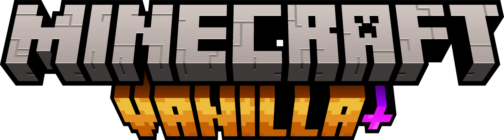

    
      
    Go to "Releases" page, and find the "1.0.0" version, in "Assets" section, download the file "Minecraft_Plus.exe". Read all the instructions below and then just enjoy!

# About this Software

Minecraft Plus is a Launcher that lets you prepare and play the Vanilla+ Modpack created by Marcos Tomaz. Everything is quick, easy, and stress-free. The Launcher doesn't require access to your Mojang account, and you'll only need it if you want to change your skin in-game.

There are several versions of the Vanilla+ Modpack created by Marcos Tomaz, and this Launcher also lets you choose one to play. If you choose a version that isn't ready, the Launcher will take care of everything.

>[!NOTE]
> There is no dedicated server version of this Modpack. To play with friends, open your world to LAN, so players on your local network can join your world. For players outside of your local network, use a program like Hamachi, or if you have Direct NAT, forward ports from your router to your computer.

# To use this Software

Follow the steps below to install Minecraft+ Launcher on your computer and play the Vanilla+ Modpack, using this Launcher.

<b>1.</b> Go to the "Releases" page of this repository and look for version "1.0.0", then in the "Assets" section download the file "Minecraft_Plus.exe" to your computer.

<b>2.</b> Run the file "Minecraft_Plus.exe" now. The Launcher will begin performing all the necessary steps to install/update your game, until it is 100% ready to play!

That is all! Don't forget to continue reading the rest of the content below to find out everything you need to know!

# Prerequisites to use this Software or Modpack

You need to fulfill some requirements to be able to use this Software or play the Vanilla+ Modpack...

- The computer may need to have <a href="https://download.visualstudio.microsoft.com/download/pr/81531ad6-afa9-4b61-9d05-6a76dce81123/2885d26c1a58f37176fd7859f8cc80f1/dotnet-sdk-6.0.417-win-x64.exe" target="_blank">.Net 6.0</a> installed in order to run the Software.
- Your computer must have Microsoft Edge installed.
- The computer must be 64-bit.
- Your computer's operating system must be Windows 10 or newer.
- Your computer must have at least 25GB free on drive C.

# Minimum Hardware requirements to play Modpack

- 12 Thread CPU (like "Intel i5 11400" or "AMD Ryzen 5 5600") or better.
- 16GB of RAM DDR4 or better.
- Graphics of NVidia GTX 1650 / AMD RX 580 or better.
- NVMe SSD is recommended (especially if you intend to open your world for LAN).

# How to edit this Software

The source project of this Software is here in this repository as well. You can simply open the "Minecraft-Plus-Source" folder with your Visual Studio IDE and edit the Software.

# Support projects like this

If you liked the Minecraft+ Launcher and found it useful for your, please consider making a donation (if possible). This would make it even more possible for me to create and continue to maintain projects like this, but if you cannot make a donation, it is still a pleasure for you to use it! Thanks! 😀

 

    

 

Created with ❤ by Tomaz Collaborations

