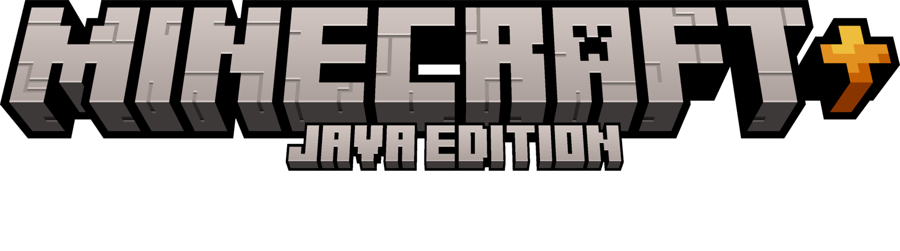
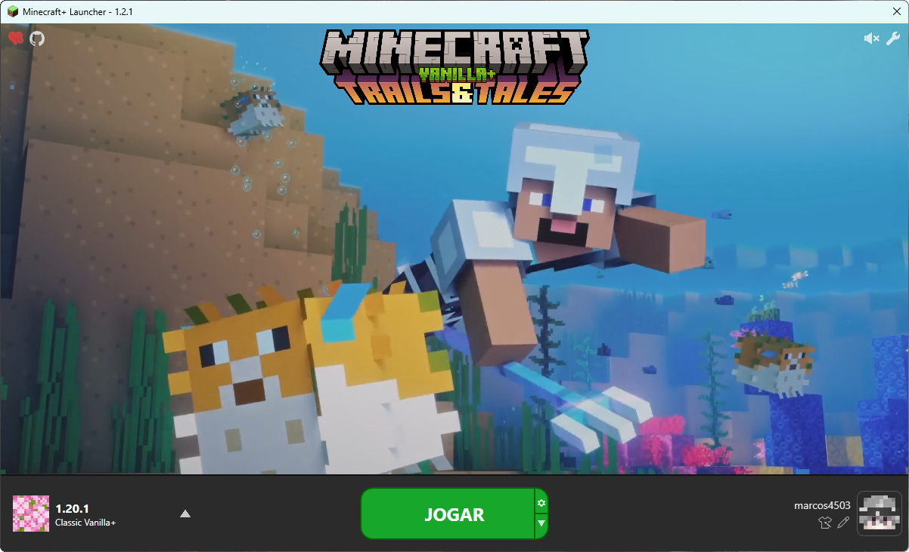

    
    
      
    Vá para a página "Releases", encontre a versão "1.0.0". Na seção "Assets", baixe o arquivo "Minecraft_Plus.exe". Leia o resto dessa página pra ter mais informações, e divirta-se!

# Sobre este Software

O Minecraft Plus é um projeto de Launcher que foi desenvolvido para ser a casa de todos os Modpacks de Minecraft Java Edition que eu desenvolvo. O Minecraft Plus tem como objetivo, fornecer uma maneira de jogar Modpacks de Minecraft da maneira mais simples possível, gratuita, e claro, sem instalar um monte de coisas que ficarão rodando em plano de fundo no seu PC, apenas sujando seu Sistema Operacional.

Primeiramente, o Launcher não requer um acesso a sua conta da Mojang, então, você só precisará usar sua conta, se quiser jogar com sua Skin original. Uma vez que ele é baixado e executado, você só precisará escolher o Modpack que deseja jogar (ou Instância de Jogo) e clicar em "Instalar". Durante a Instalação, o Launcher vai baixar e instalar o Java necessário, junto dos arquivos do jogo e já deixar tudo configurado pra você. Então, você não precisará tocar em nenhum arquivo de configuração de nenhum mod, não precisará ficar perdendo tempo ajustando Bindings de Teclas, baixando Shaders ou os configurando, nem nada disso.

>[!NOTE]
> Os Modpacks disponibilizados no Minecraft Plus, não possuem uma versão de Servidor Dedicado. Eles foram criados primariamente, com o objetivo de serem jogados entre amigos, onde um Host abre o seu Mundo para os amigos entrarem para jogar. Para jogar com seus amigos, primeiramente, entre no Mundo e o abra para LAN, dessa forma, os jogadores na sua Rede Local, poderão entrar para jogar.
> 
> Para que jogadores fora da sua Rede Local possam entrar para jogar, você pode usar Softwares como Hamachi/RadminVPN para simular uma Rede Local com seus amigos, mesmo eles estando em diferentes locais. Para isso, é só cada um dos seus amigos instalarem esse Software, então você cria uma Rede e os coloca nela. Apenas fazendo isso, se cada um tiver uma conexão com a Internet ativa, agora, já poderão jogar juntos. Há vários vídeos no Youtube ou artigos na Internet, explicando como fazer isso.
> 
> Se quiser evitar o uso do Hamachi/RadminVPN, então você precisará ter uma conexão a Internet, com NAT Direto (IP Público), redirecionando portas do seu Roteador para o seu PC que vai ter o Mundo de Minecraft, rodando. Se quiser evitar essa complicação, ou se você não tem conhecimento para fazer isso, vá para o caminho do Hamachi/RadminVPN.

# To use this Software

Follow the steps below to install Minecraft+ Launcher on your computer and play the Vanilla+ Modpack, using this Launcher.

<b>1.</b> Go to the "Releases" page of this repository and look for version "1.0.0", then in the "Assets" section download the file "Minecraft_Plus.exe" to your computer.

<b>2.</b> Run the file "Minecraft_Plus.exe" now. The Launcher will begin performing all the necessary steps to install/update your game, until it is 100% ready to play!

That is all! Don't forget to continue reading the rest of the content below to find out everything you need to know!

# Prerequisites to use this Software or Modpack

You need to fulfill some requirements to be able to use this Software or play the Vanilla+ Modpack...

- The computer may need to have <a href="https://download.visualstudio.microsoft.com/download/pr/81531ad6-afa9-4b61-9d05-6a76dce81123/2885d26c1a58f37176fd7859f8cc80f1/dotnet-sdk-6.0.417-win-x64.exe" target="_blank">.Net 6.0</a> installed in order to run the Software.
- Your computer must have Microsoft Edge installed.
- The computer must be 64-bit.
- Your computer's operating system must be Windows 10 or newer.
- Your computer must have at least 25GB free on drive C.

# Minimum Hardware requirements to play Modpack

- 12 Thread CPU (like "Intel i5 11400" or "AMD Ryzen 5 5600") or better.
- 16GB of RAM DDR4 or better.
- Graphics of NVidia GTX 1650 / AMD RX 580 or better.
- NVMe SSD is recommended (especially if you intend to open your world for LAN).

# How to edit this Software

The source project of this Software is here in this repository as well. You can simply open the "Minecraft-Plus-Source" folder with your Visual Studio IDE and edit the Software.

# Support projects like this

If you liked the Minecraft+ Launcher and found it useful for your, please consider making a donation (if possible). This would make it even more possible for me to create and continue to maintain projects like this, but if you cannot make a donation, it is still a pleasure for you to use it! Thanks! 😀

 

    

 

Created with ❤ by Marcos Tomaz

